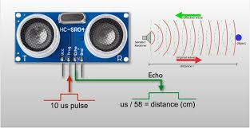
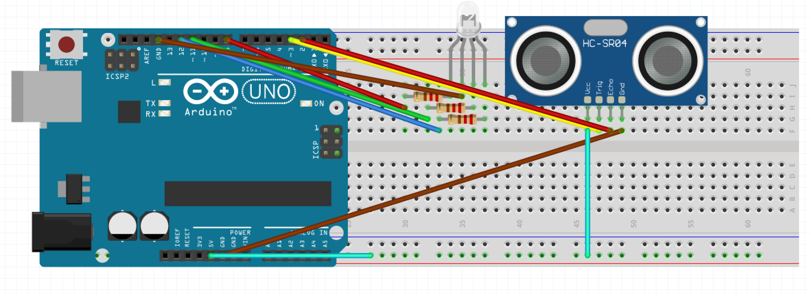
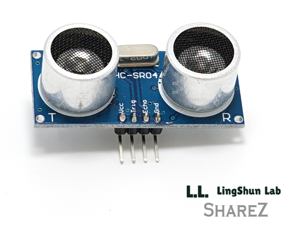
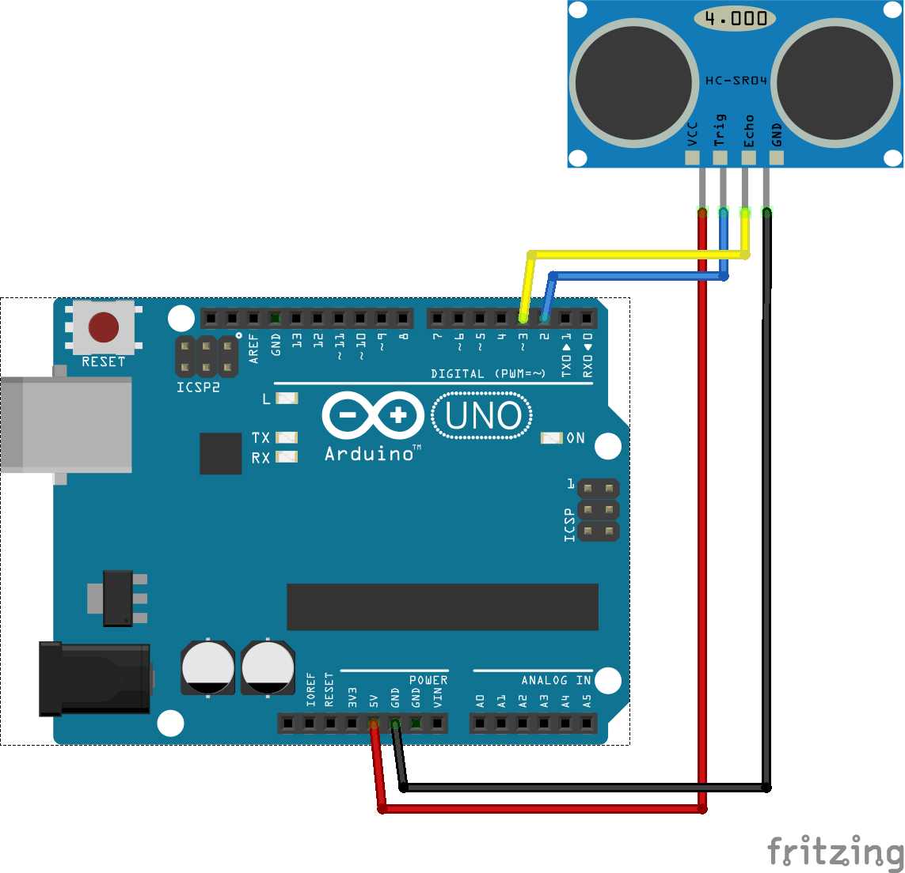
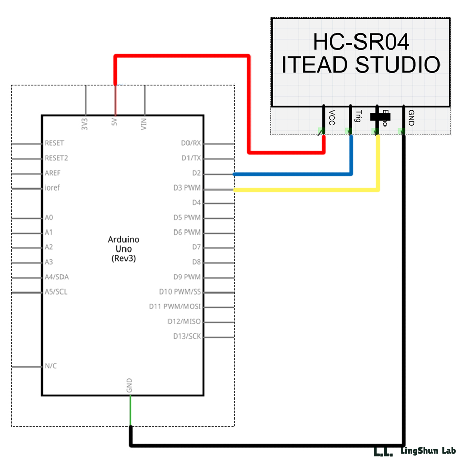

Device Description
******************
The device we will be demonstrating for our project is the ultrasonic wave sensor, the HC-SR04.

.. image:: img/ultrasonic.png
	:align: center

.. csv-table:: Device Features
   :header: "Feature", "Description"
   :delim: |

    Power Supply| +5V DC
    Quiescent Current| <2mA
    Working Current| 15mA
    Working Frequency| 40Hz
    Effectual Angle| <15°
    Ranging Distance| 2cm – 4m /1" – 13'
    Resolution| 0.3 cm
    Measuring Angle| 30° cone
    Trigger Input Pulse width| 10uS
    Dimension| 45mm x 20mm x 15mm

.. csv-table:: This device has 4 Pins
   :header: "PIN", "Description"
   :delim: |

    VCC| 5V, positive end of the power supply
    TRIG| Trigger Pin
    ECHO| Echo Pin
    GND| 0V, ground, negative end of the power supply

The TRIG and ECHO pins will be used to communicate from our microcontroller to the ultrasonic module. 

The HC-SR04 ultrasonic sensor is able to measure distances of objecs by utilizing sonar.

1. The transmitter (trig pin) sends a trigger signal: an 8 cycle ultrasonic burst at 40kHz.

2. The trigger signal will be reflected off of any object within the devices range of 400 cm.

3. The transmitter (echo pin) will receive the signal.

An object's distance can be calculated using the time from the emission of the trigger signal to the return of the echo: (high level time * 340m/s(velocity)) / 2
Recommended interval time is 60ms.

For best results, objects should be larger than .5m. Smaller objects may be registered from close distances, but not guaranteed to be registered within reported range. The device also recommends as smooth of a plane as possible. HC-SR04 is most commonly used for robotics obstacle detection, mapping surroundings and depth measurement (ultrasonic signals penetrate water). It may also be implemented to take measurements of depths, speed, and direction, for wireless charging, burglar alarms, humidifiers, interactive art and automation. 

-Ruben Suarez
-Corbin Walters
-Kameron Moncus

How To Control the Device
*************************
1. Assign an arduino pin to both the echo and trig pins

2. Assign the trig pin as an output and the echo pin as an input

3. Will need to send a "HIGH" pulse through the trig pin for at least 10 microseconds

4. Wait for the echo pin to receive the signal after it has been bounced off an object

This ability can be useful if you know the speed of the ultrasonic waves (speed of sound) and the time it took for the signal to be bounced back. You can use that information to calculate the distance of the object from where the ultrasonic wave has been bounced.

For our project, a counter was created to keep track of the time it took for the signal to be bounced back. We did this by simply calling a delay function that approximated the time it would have taken sound to travel a centimeter. The counter(register 21) was increased by one each time that the delay function was called before receiving a signal back.

We were then able to come up with a program that would "alert" us if any object was closer then about 10 centimeters. We did this by utilizing and RGB LED that was programmed to change colors as the counter reached certain thresholds. 

-Ruben Suarez

Device Demonstration
********************
.. image:: img/IntroHC-SR04.jpg
        :align: center

-Ruben Suarez
-Kameron Moncus

Project Code
************
main.c
======
::

    // Copyright 2019 Ruben Suarez

    #include <avr/io.h>
    #include <util/delay.h>

    //--- PIN Assignments ----------------------------------------------------
    #define RED_PIN             0
    #define GREEN_PIN           5
    #define BLUE_PIN            4

    //--- PIN Controls -------------------------------------------------------
    #define RED_ON              (PORTB |= (1<<RED_PIN))
    #define RED_OFF             (PORTB &= ~(1<<RED_PIN))
    #define GREEN_ON            (PORTB |= (1<<GREEN_PIN))
    #define GREEN_OFF           (PORTB &= ~(1<<GREEN_PIN))
    #define BLUE_ON             (PORTB |= (1<<BLUE_PIN))
    #define BLUE_OFF            (PORTB &= (0X01))

    //--- Device Setup -------------------------------------------------------
    #define OUTPUT_CONFIG       (DDRB |= (1<<RED_PIN) | (1<<GREEN_PIN) | (1<<BLUE_PIN))
    #define CPU_PRESCALE(n)     (CLKPR = 0x80, CLKPR = (n))

    //--- LED ----------------------------------------------------------------
    void LEDColor(int distance) {

       if (distance > 400) {
    	    BLUE_ON;
       }
       if (distance < 10) {
      	    RED_ON;
       }
       else {
      	    GREEN_ON;
       }
    }

    //--- Main ----------------------------------------------------------
    int main(void) {
       OUTPUT_CONFIG;
       int distance;

       //--- Main Loop ------------------------------------------------------
       while(1){
	    BLUE_OFF;
   	    GREEN_OFF;
   	    RED_OFF;
      	    distance = sonar();
    	    LEDColor(distance);
       }
       return 0;
    }

Sonar.S
=======
::

    #include "config.inc"

	    .section    .text
            .global     sonar
	    .org        0x0000

    sonar:
	    ; initialize the CPU clock to run at full speed
	    ldi             r24, 0x80
            sts             CLKPR, r24              ; allow access to clock setup
            sts             CLKPR, r1               ; run at full speed

            sbi             SENSOR_DIR, TRIG_PIN         ; sets pin 3's direction to output => Trig Pin
            cbi             SENSOR_DIR, ECHO_PIN         ; sets pin 2's direction to input  <= Echo Pin
            cbi             SENSOR_PORT, TRIG_PIN        ; sets the output to LOW
    trig:						
            sbi             SENSOR_PORT, TRIG_PIN        ; set Trig Pin to HIGH to send a ultrasonic wave burst
            call            tenMicroDelay                ; HIGH signal must continue for 10 microseconds
            cbi             SENSOR_PORT, TRIG_PIN        ; set the output to LOW after waves are sent
    echo:
            clr             r21                          ; clear counter value
    echowait:
            call            Delay        		 ; giving it time to travel 1cm
            inc             r21                          ; increment counter for each cm
            sbic            SENSOR_PIND, ECHO_PIN	 ; break out of loop if echo received
            rjmp            echowait                     ; otherwise keep waiting for the echo
            clr		    r25			         ; zero out high bits of return register
            mov		    r24, r21                     ; set lower bits to the value of counter
            call            Delay
            ret					         ; return to calling function
    Delay:
            ldi             r18, 2                       ; set outter loop to 2
	    ldi		    r19, 41                      ; set inner loop to 41
    1:      dec		    r19			
	    brne	    1b
	    dec		    r18
	    brne	    1b			
	    ret					         ; return after ~1 cm of travel

    tenMicroDelay:
            ldi             r18, 50                      ; set loop to 50
    1:      dec		    r18			
	    brne	    1b
	    ret					         ; return after 10 microseconds
        
config.inc
==========
::

    #include <avr/io.h>
    #define TRIG_PIN	3
    #define ECHO_PIN	2
    #define SENSOR_DIR      _(DDRD)
    #define SENSOR_PORT     _(PORTD)
    #define SENSOR_PIND     _(PIND)

    // include this line to avoid SFR_REG issues
    #define _(s)    _SFR_IO_ADDR(s)

-Ruben Suarez

Buzzer Implimentation
=====================
Along with the LED changing colors depending on an objects distance from the sonic sensor, we were also able to have a buzzer sound when an object comes within "danger range". This could be useful for back-up or low velocity impact warning sensors on a vehicle. 
::
    // Define pins for ultrasonic and buzzer
    int const TRIG_PIN = 3;
    int const ECHO_PIN = 2;
    int const BUZZ_PIN = 10;
    void setup()
    {
    pinMode(TRIG_PIN, OUTPUT); // trig pin with pulse output
    pinMode(ECHO_PIN, INPUT); // echo pin - input for pw
    pinMode(BUZZ_PIN, OUTPUT); // buzz pin is output -BZZZ
    }
    void loop()
    {
    // pw is input pulse width, d is the distance to the obstacle in cm
    int pw, d;
    // Output pulse with 1ms width on trigPin
    digitalWrite(TRIG_PIN, HIGH);
    delay(1);
    digitalWrite(TRIG_PIN, LOW);
    // Measure the pulse input in echo pin
    pw = pulseIn(ECHO_PIN, HIGH);
    // Distance is half the duration divided by 29.1
    d = (pw/2)/2.91;
    // (0 or less is out of range)
    if (d <= 60 && d >= 0) {
    // Buzz
    digitalWrite(buzz_Pin, HIGH);
    } else {
    // Don't buzz
    digitalWrite(buzz_Pin, LOW);
    }
    // Waiting 100 ms won't hurt any one
    delay(100);
    }

This code will cause the buzzer to alarm if there is anything within it's viewing range up to ~2ft.
-Kameron Moncus

HC-SR04 
*********
A sensor that uses ultrasonic to measure distance, which is mostly used in robots to avoid obstacles and distance measurement.

Its module, triggering ranging with Trig

Eight 40khz square waves will be sent to automatically detect if there is a signal return

There is a signal return, output high level through echo, the high level lasts twice the distance

Measuring distance = (high time * sound speed) / 2

The main technical parameters
*******************************

1: Use voltage: DC---5V

2: quiescent current: less than 2mA

3: Level output: 5V high

4: Level output: bottom 0V

5: Induction angle: no more than 15 degrees

6: Detection distance: 2cm-450cm

7: High precision up to 0.2cm

- Gu

Wiring method
*****************

Program implementation
*************************
main.cpp
======
::

    #include <avr/io.h>
    #include <util/delay.h>

    #define Trig 2 
    #define Echo 3  
 
    float cm; //
    float temp; // 
 
    void setup() {
      Serial.begin(9600);
      pinMode(Trig, OUTPUT);
      pinMode(Echo, INPUT);
    }
 
    void loop() {
      
      digitalWrite(Trig, LOW); 
      delayMicroseconds(2);    
      digitalWrite(Trig,HIGH); 
      delayMicroseconds(10);    
      digitalWrite(Trig, LOW); 

      temp = float(pulseIn(Echo, HIGH)); 

      cm = (temp * 17 )/1000;

      Serial.print("Echo =");
      Serial.print(temp);
      Serial.print(" | | Distance = ");
      Serial.print(cm);
      Serial.println("cm");
      delay(100);
    }
  

Instance effect
******************

Press the serial port monitor, you can see that the measured distance is 9.8cm-10.1cm, the error is about 0.2cm.

- Gu

.. Sources    https://cdn.sparkfun.com/datasheets/Sensors/Proximity/HCSR04.pdf
..            https://howtomechatronics.com/tutorials/arduino/ultrasonic-sensor-hc-sr04/
